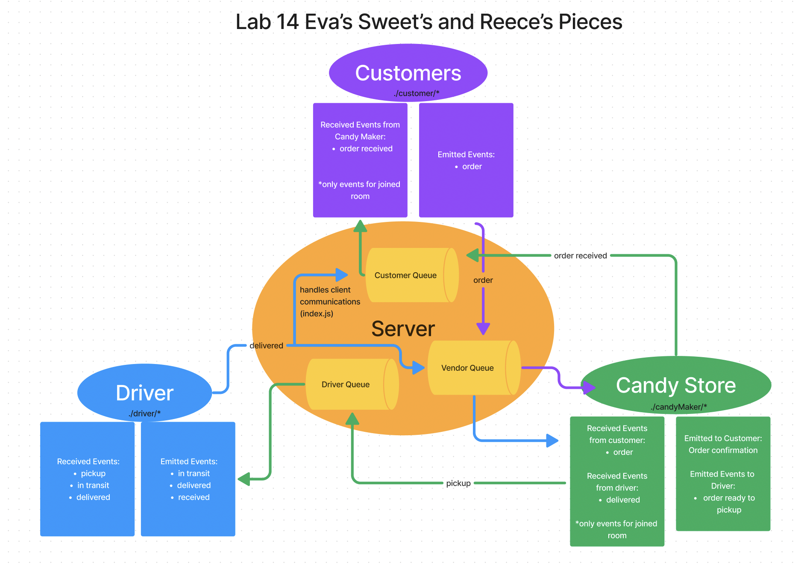

# LAB - Class 14

## Project: Candy/Food Delivery Service

### Author: Eva Grace Smith and Reece Renninger

### Problem Domain  

Utilizing a socket server to create a delivery service that allows a customer to connect and send order requests to our candy store that drivers would then respond to and conduct the pickup and delivery.  Upon confirmation of delivery the vendor would send a thank you message to the customer for their order.

Stretch Goals:

- Implement a standard queue
- allow users to send "tips/thank you notes" to driver after order is received (deleted from queue).

### Links and Resources

- [GitHub Actions ci/cd](https://github.com/ReeceRenninger/lab14/actions/new)
- [back-end server url](http://xyz.com) (when applicable)

### Collaborators

-

### Setup

#### `.env` requirements (where applicable)

env = < port of your choice >

#### How to initialize/run your application (where applicable)

- node index.js in each individual folder to start either the user/vendor/server

#### How to use your library (where applicable)

#### Features / Routes

- Feature One: Details of feature
- GET : `/hello` - specific route to hit

#### Tests

npm test will run all available tests

#### UML

